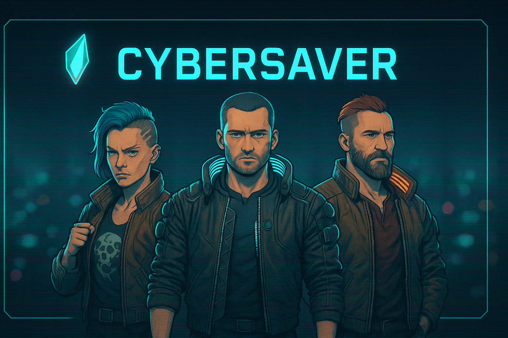

# CyberSaver



Save smarter in Night City. CyberSaver is a Windows tray app that keeps multiple Cyberpunk 2077 save profiles safe, organized, and one click away — without touching your game settings.

[⬇ Download latest release](https://github.com/andywade84/CyberSaver/releases/latest)

## Why CyberSaver
- **Profile switching without fuss**: Junction-based, so the game always sees only the active profile’s saves.
- **Zero surprises**: First-run backup, warnings before replacing existing junctions, and a red tray icon that blocks switching while Cyberpunk is running.
- **Know your saves**: Screenshots, quest title/objective lookup, playtime, level, filters (auto/manual), and search by mission/save.
- **Move and share easily**: Import current saves into a profile, copy a save to another profile, export a profile as ZIP, add per-profile notes.
- **Always on, never in the way**: Lightweight local web UI with tray controls (Open / Exit). Close the browser; reopen from the tray anytime.

## Requirements
- Windows: Cyberpunk 2077 saves in the default location (`%USERPROFILE%\Saved Games\CD Projekt Red\Cyberpunk 2077`) or a folder you select.
- Go 1.22+ to build from source.

## Build
```powershell
cd src
# (one-time) install icon generator: go install github.com/akavel/rsrc@latest
go generate
New-Item -ItemType Directory -Force ../build | Out-Null
go build -o ../build/cybersaver.exe
```
Produces `build/cybersaver.exe`. UI and quest data are embedded.

## Run
```powershell
.\build\cybersaver.exe
```
- First run: shows safety prompt, backs up the current save folder, and warns if an existing junction points elsewhere.
- Opens `http://localhost:8787` in your browser (port can be configured during startup). The app stays in the system tray; reopen from “Open CyberSaver”.
- Tray icon turns **red** and switches/imports are blocked while Cyberpunk is running to protect your saves.

## Notes
- Profiles live under `profiles/` next to the executable, or the location you set during first run. Loading a profile replaces the game save folder with a junction to that profile.
- The UI auto-refreshes saves every few seconds; use filters/search to narrow results.
- **Cloud saves:** Steam/GoG can drop cloud saves into the game folder on launch. To avoid surprise new folders or old saves resurfacing, disable cloud saves for Cyberpunk 2077 in your launcher.
- **Backups:** Always keep an off-machine copy of profiles (e.g., OneDrive/Dropbox/Google Drive).
- **Restore / uninstall:** Close Cyberpunk and exit CyberSaver (tray → Exit). Remove the junction and copy your active profile back to the original save folder:  
  1) Find the game save path (default `%USERPROFILE%\Saved Games\CD Projekt Red\Cyberpunk 2077`).  
  2) Check the junction target (PowerShell): `Get-Item "<game-save-path>" | Select-Object -Expand Target` (that is your active profile folder).  
  3) Remove the junction: `cmd /C rmdir "<game-save-path>"`.  
  4) Copy the profile back: `Copy-Item "<profile-folder>\\*" "<game-save-path>\\" -Recurse`.  
  After that, the game uses the normal folder again.
- **Trust & verification:** If you prefer not to run the downloaded EXE, build from source (`src/` → `build/`) and compare hashes to the release asset. The app only serves a UI on localhost and does not phone home.
